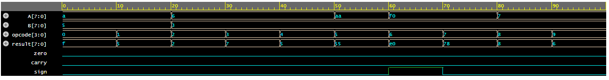

# Parameterized ALU in Verilog

This project implements a simple Arithmetic Logic Unit (ALU) using Verilog.

## Features
- Parameterized bit width
- Arithmetic operations: ADD, SUB, INC, DEC
- Logical operations: AND, OR, XOR, NOT
- Shift operations: SLL, SRL
- Flags: zero, carry, sign

## Tools Used
- Verilog HDL
- Icarus Verilog
- EDA Playground

## Simulation
The design was verified using a testbench and waveform analysis.

## Simulation Waveform

## Author
Snigdha Bhardwaj
B.Tech ECE